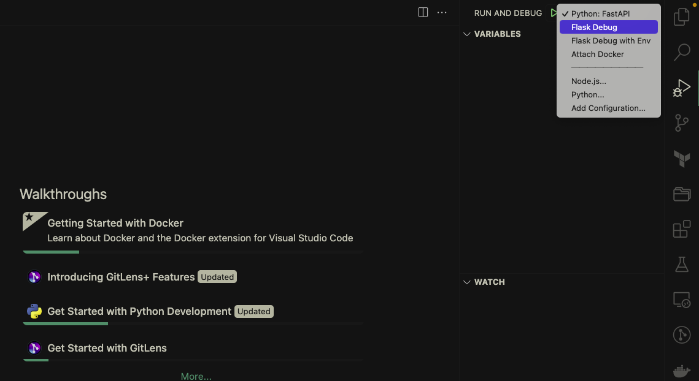
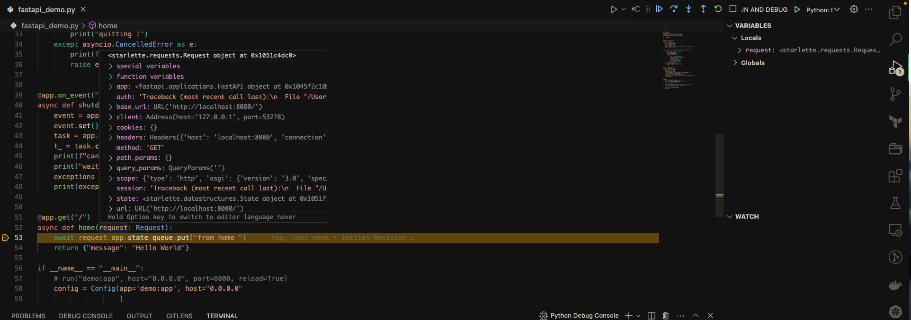

# How to Use

---

- Click on the debug Icon on the left/right menu bar in `vscode`.
- Select Debugging configuration from the drop downs.
  

- Click on the play button next to `RUN AND DEBUG` to start debugger.
- Put the break points in you code and enjoy.
  

> For Attach Docker Debugging configuration, you would require `Docker Desktop` to be running. For best experience, have [Docker Extension](https://marketplace.visualstudio.com/items?itemName=ms-azuretools.vscode-docker) installed.
